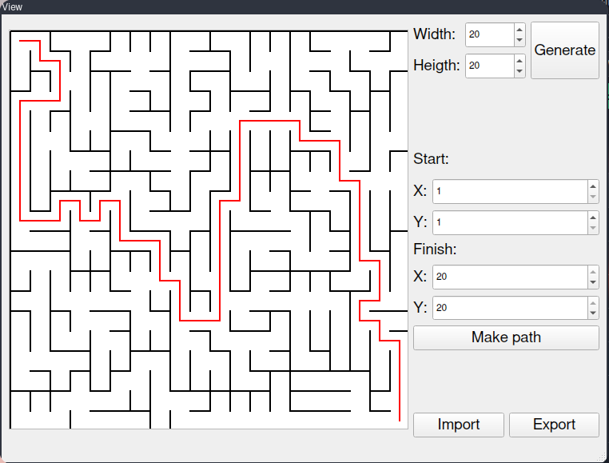

# Maze generator with graphical user interface
Implements generating(Eller's maze generation algorithm), solving(self-written), rendering mazes with adjustable properties using MVC pattern.

## Stack:
C++, QT6, STL
